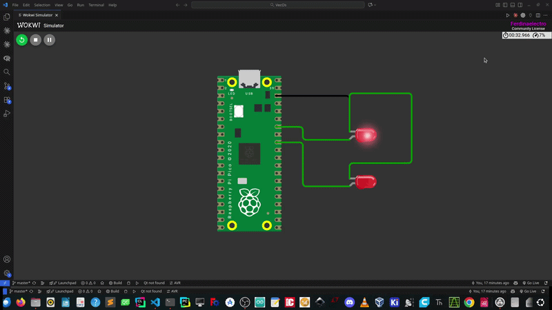

# VectOS

> Lightweight preemptive RTOS micro-kernel for the RP2040, written in ARM Cortex-M0+ Assembly and Modern C++17.

[](LICENSE)
[](https://www.raspberrypi.com/products/rp2040/)
[]()

---

## What is VectOS?

VectOS is a from-scratch RTOS micro-kernel targeting the **Raspberry Pi Pico (RP2040)**. It combines bare-metal ARM Cortex-M0+ assembly for context switching with a clean C++17 API to make preemptive multitasking accessible without sacrificing reliability or memory safety.

**Core design goals:**
- Zero heap usage — all stacks are statically allocated at compile time via C++ templates
- Minimal API surface — three calls to get tasks running
- No external dependencies beyond the Pico SDK

---

## Features

- **Preemptive multitasking** — context switches are driven by the hardware SysTick timer and the `PendSV` exception, not cooperative yields
- **Pure round-robin scheduling** — execution time shared fairly and symmetrically among all registered tasks
- **Type-safe static stack allocation** — `vecos::Task<StackSize>` allocates each task's stack at compile time, guaranteeing zero heap fragmentation and no runtime allocation failures
- **Clean C++ API** — hides raw register manipulation behind a straightforward object-oriented interface

---

## Project Structure

```
VectOS/
├── CMakeLists.txt
├── README.md
├── pico_sdk_import.cmake
├── include/
│   └── vecos/
│       └── scheduler.h          # TaskBase, Task<N>, and Scheduler declarations
├── src/
│   ├── scheduler.cpp            # Scheduler core implementation & vTaskSwitchContext
│   └── ports/
│       └── rp2040_context_switch.S  # ASM context save/restore, PendSV & SVC handlers
└── examples/
    └── blink/
        ├── CMakeLists.txt
        └── main.cpp             # Two preemptive blinking tasks
```

---

## Quick Start

### Prerequisites

Install the GNU ARM Embedded Toolchain:

```bash
sudo apt update
sudo apt install cmake gcc-arm-none-eabi build-essential libnewlib-arm-none-eabi
```

Set your Pico SDK path:

```bash
export PICO_SDK_PATH=/opt/pico-sdk   # adjust to your local installation
```

> CMake will automatically fetch and build `picotool` locally if it is not found on your system — no manual installation required.

### Build

```bash
git clone https://github.com/Ferdinaelectro1/VecOs.git
cd VectOS
mkdir build && cd build
cmake ..
make -j$(nproc)
```

### Flash

Boot your Pico in **BOOTSEL** mode, then drag and drop `roundrobin.uf2` from the `build/` directory onto the mounted volume.

---

## Usage

```cpp
#include <pico/stdlib.h>
#include <vecos/scheduler.h>

#define LED_PIN 28

void BlinkTask(void* arg) {
    (void)arg;
    gpio_init(LED_PIN);
    gpio_set_dir(LED_PIN, GPIO_OUT);

    while (true) {
        gpio_put(LED_PIN, 1);
        for (volatile int i = 0; i < 2500000; i++);
        gpio_put(LED_PIN, 0);
        for (volatile int i = 0; i < 2500000; i++);
    }
}

// Statically allocate a 4KB stack for this task — no heap involved
vecos::Task<1024> task1(BlinkTask);

vecos::Scheduler os;

int main() {
    os.add_task(task1);
    os.start();         // never returns
}
```

The `Task<N>` template parameter is the stack size in 32-bit words. `Task<1024>` allocates 4KB.

---

## How It Works

```
SysTick fires every 5ms
        │
        ▼
SVC handler triggered (svc #0)
        │
        ▼
PendSV pended (lowest priority — executes after all hardware IRQs clear)
        │
        ├─ ASM saves R4–R11 onto the current task's PSP
        │
        ├─ C++ vTaskSwitchContext() selects the next task (round-robin index)
        │
        └─ ASM restores R4–R11 from the new task's stack, updates PSP, returns
```

The hardware automatically saves and restores R0–R3, R12, LR, PC, and xPSR on every exception entry and exit — VectOS only handles the software-callee-saved registers (R4–R11) manually.

---

## Integrating VectOS into Your Project

Add VectOS as a subdirectory and link against the `vecos` target:

```cmake
add_subdirectory(libs/VectOS)

target_link_libraries(your_project
    pico_stdlib
    vecos
)
```

Your `#include` paths are configured automatically — no manual `include_directories` needed.

---

## API Reference

| Symbol | Description |
|---|---|
| `vecos::Task<N>` | Declares a task with a statically allocated stack of N words (N × 4 bytes) |
| `vecos::Scheduler` | The kernel object. One instance per application |
| `os.add_task(task)` | Registers a task. Returns `false` if the internal limit is reached |
| `os.start()` | Starts the scheduler. Never returns |
| `os.task_count()` | Returns the number of registered tasks |

---



## License

MIT — free to use, fork, and build on top of.